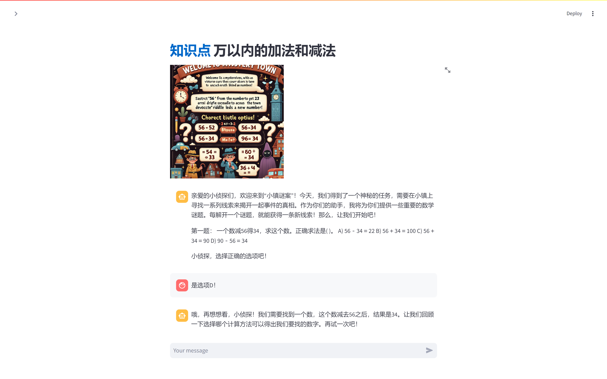
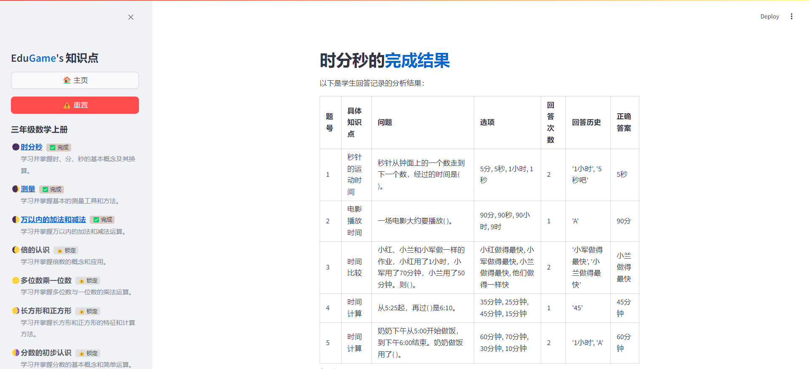
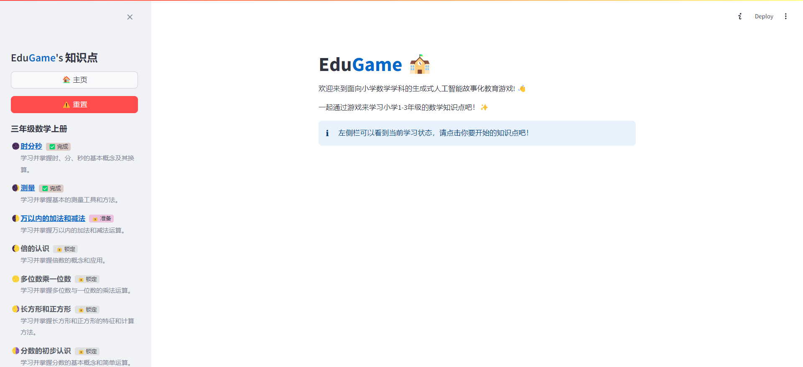
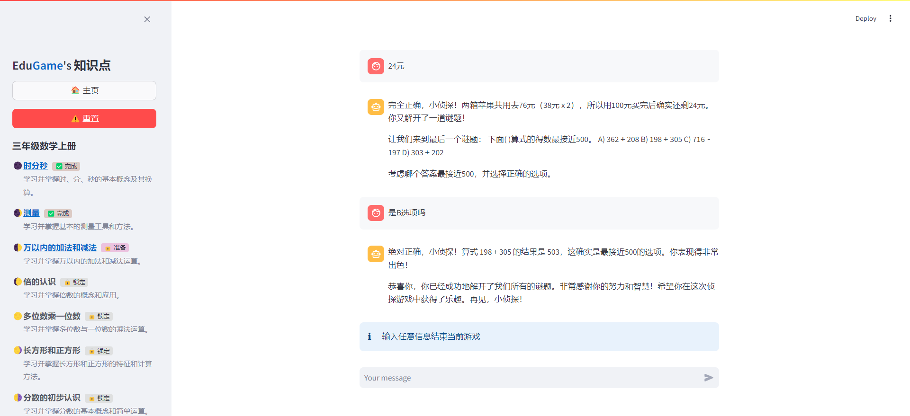

# EduGame

EduGame 是一个基于 Streamlit 的应用，旨在通过游戏化的方式进行数学教学。



## Quick Start

确保您的环境安装了 Python。然后使用以下命令安装必要的依赖： 

```
pip install -r requirements.txt
```

### 运行应用

在安装了依赖项之后，请在使用前将 OpenAI 的 API 密钥添加到环境变量中，例如：

```bash
export OPENAI_API_KEY="your-api-key"
```

使用以下命令运行 EduGame 应用：
```bash
streamlit run streamlit_app.py
```

打开 Streamlit 应用后，浏览器将自动打开，显示 EduGame 应用的界面。

## Demo






